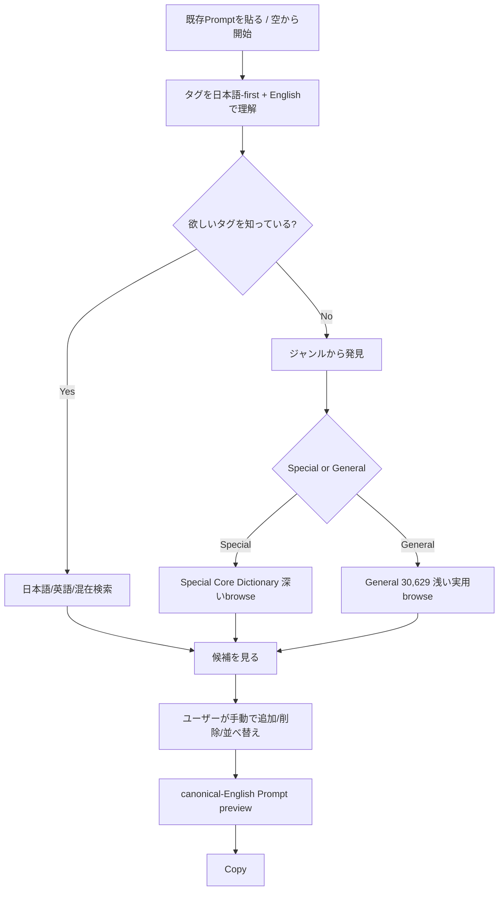
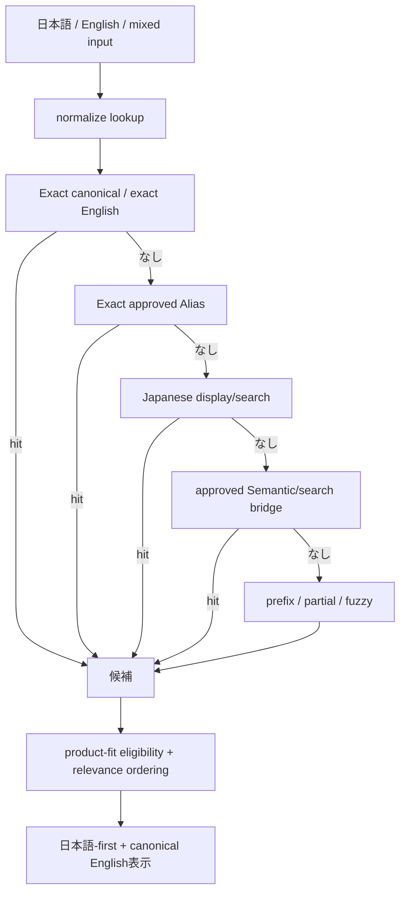
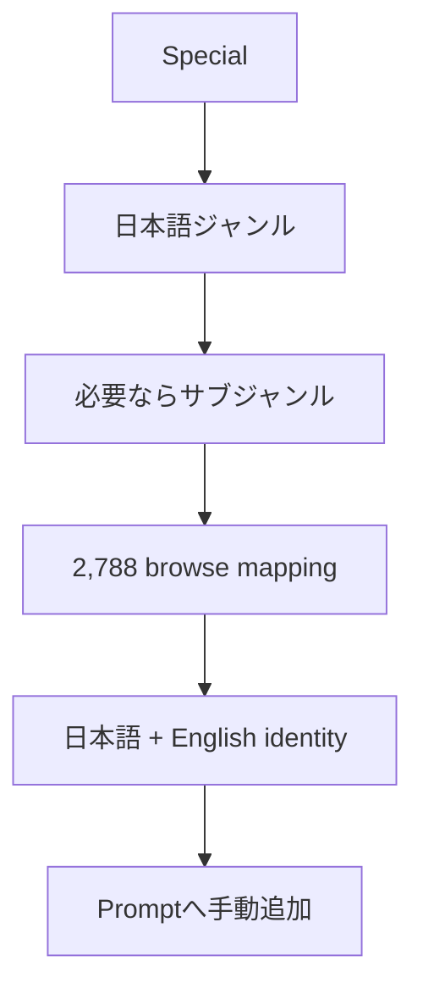
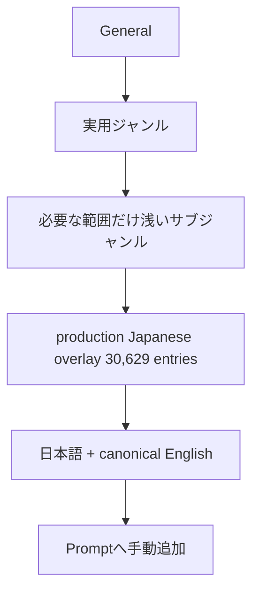
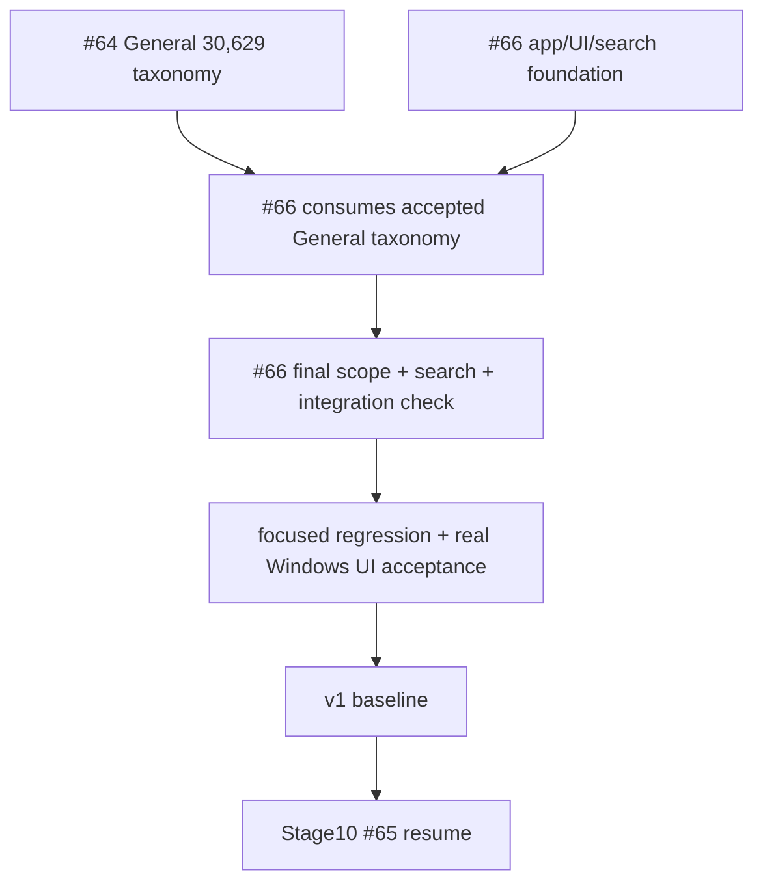
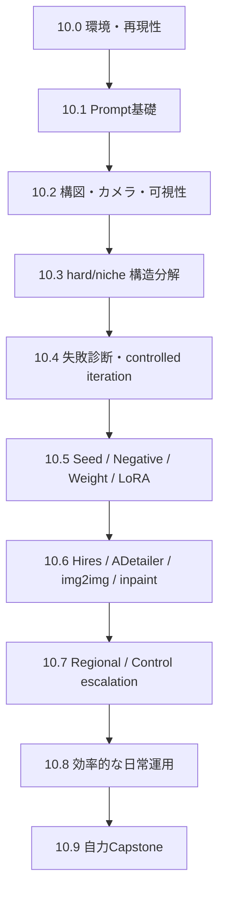
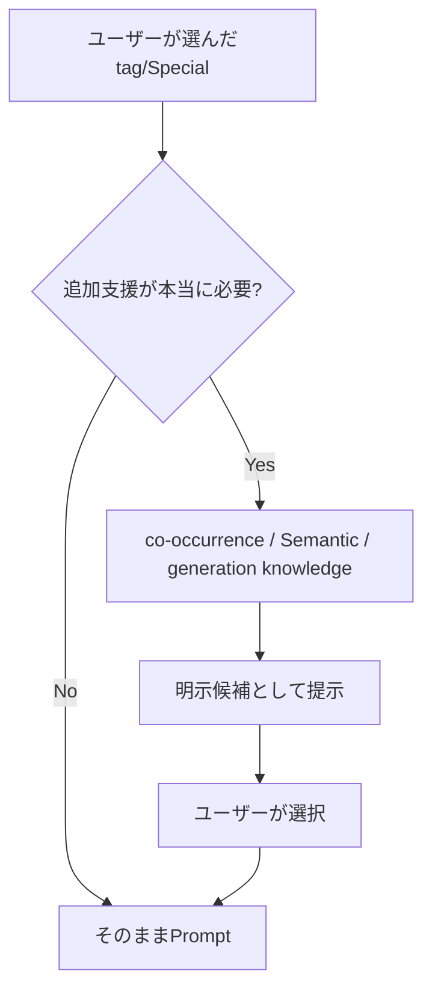
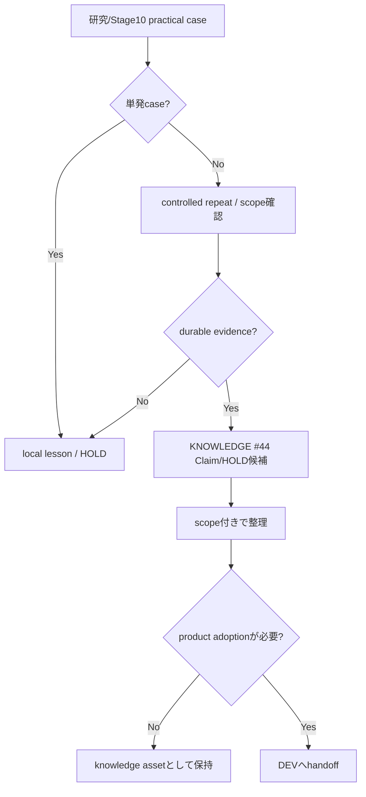

# FLOWCHARTS.md

## Current v1 user flow

## Search flow

Exact / strong Japanese intent / word-boundary intent を incidental substring/fuzzy collision より優先する。
Known regression `anal -> piano / analog...` を含む検索品質はIssue #66のacceptance scope。

## Special discovery

Special taxonomyは#56で完成済み。
UI browse indexでありcanonical semantic authorityではない。

## General discovery

General taxonomyはIssue #64。
`japanese_overlay.json` へtaxonomyを埋め込まずcanonical-tag keyed sidecarで分離する。
全100k+ Danbooru universeの完全分類はv1 scope外。

## Current development route

Exact execution orderの正本は `docs/project/CURRENT_STATE.md`。
Issues #42 / #34 は retired / closed。製品scope・検索品質・最終acceptanceはIssue #66へ統合済み。

#64と#66 foundationは並行可能。
#66は#64の分類データを先回りで発明せず、accepted sidecarを後からconsumeする。

## Current Stage10 learning flow — currently paused by priority

Current authority:
- Issue #65
- `docs/stages/STAGE_10_LEARNING.md`

Primary model:
- NoobAI XL 1.1 EPS + Forge Neo

Current user priority:
- practical v1 app baseline first
- then resume Stage10 unless explicitly changed

Stage10は製品Gateではない。

## Optional/future product subsystem flow

v1では候補を勝手にPromptへ自動挿入しない。

## KNOWLEDGE evidence flow

KNOWLEDGEは知識・検証を所有するが、production採用を独断で決めない。

## Historical architecture note

Stage0〜Stage9で作ったfull index、true AND、Candidate Aggregation、recommendation、Generation Profile、Prompt Composer、evaluator infrastructureは削除対象ではない。
旧PROMPT #5、旧Stage10 production A/B、Issue #30 evaluator/calibration、旧#42/#34 commentsはhistorical evidence/provenanceとして保持する。

旧 `Special -> true AND -> recommendation -> Prompt -> production A/B Stage10` を現在の必須ユーザーフローとして扱わない。
