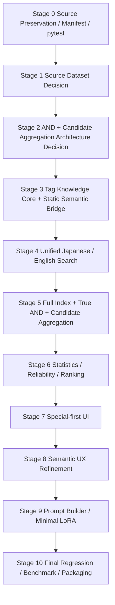
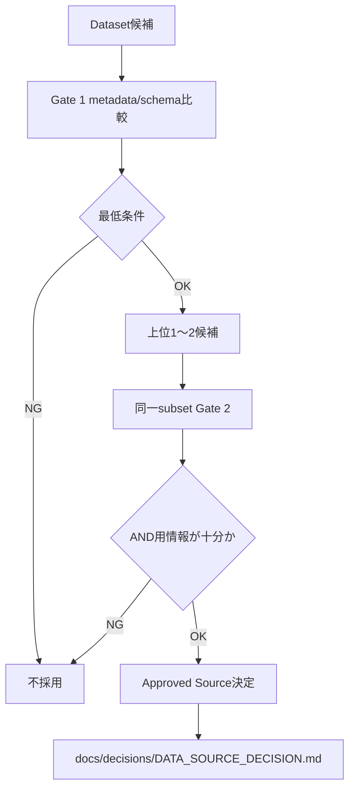
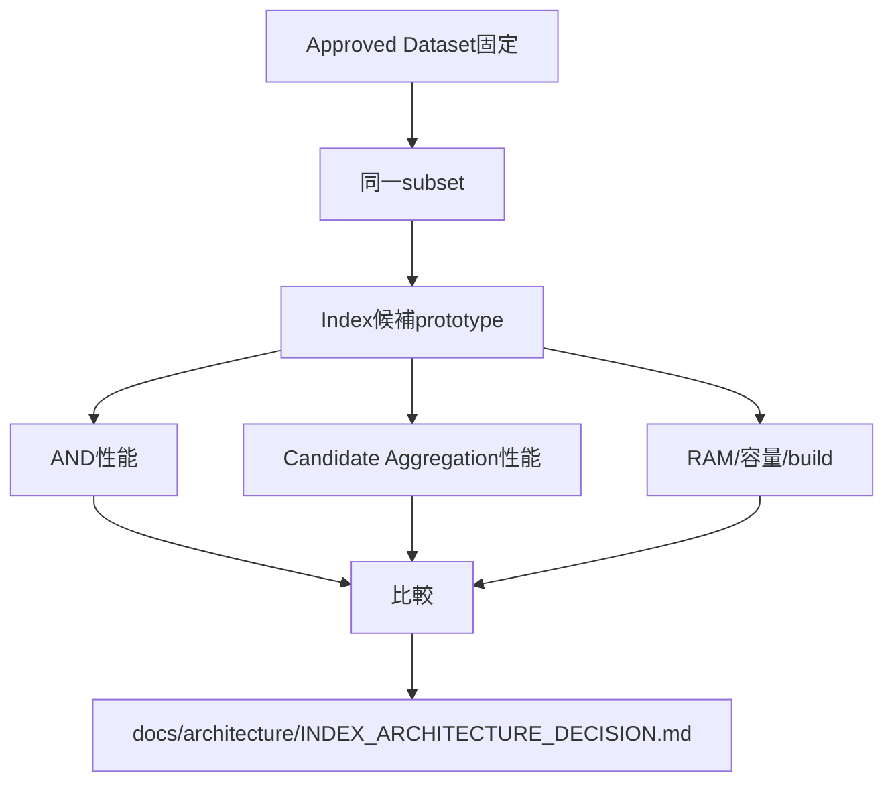
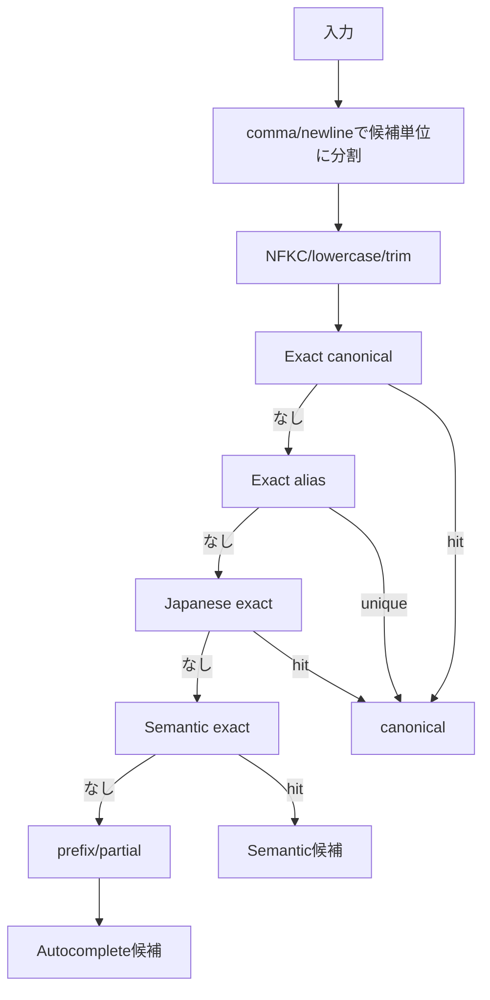
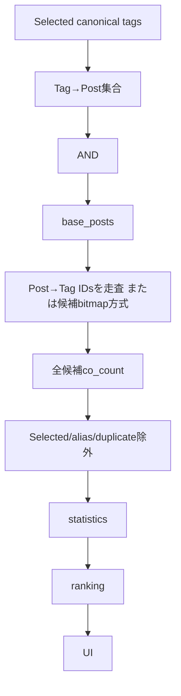
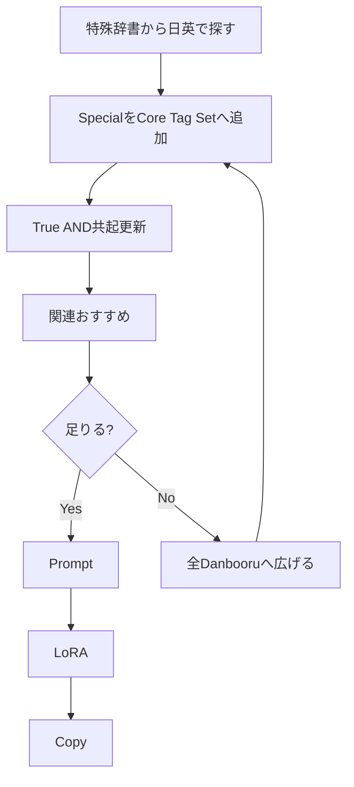
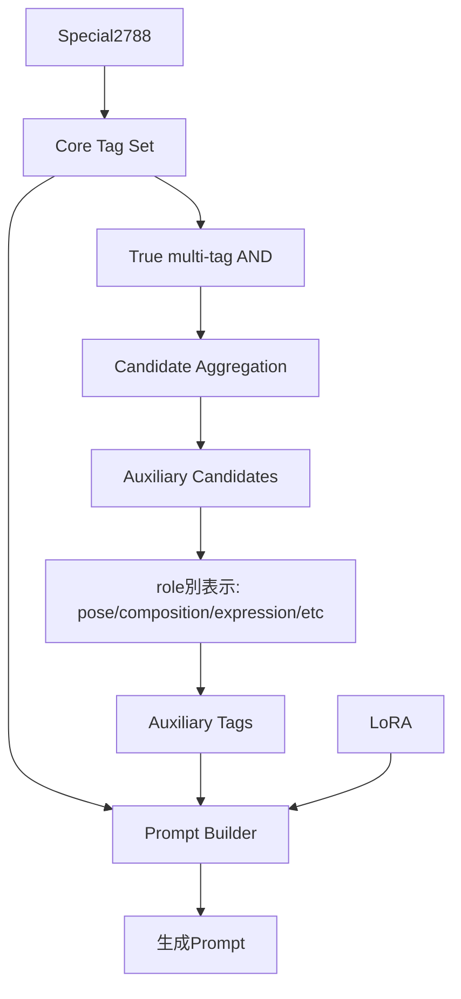
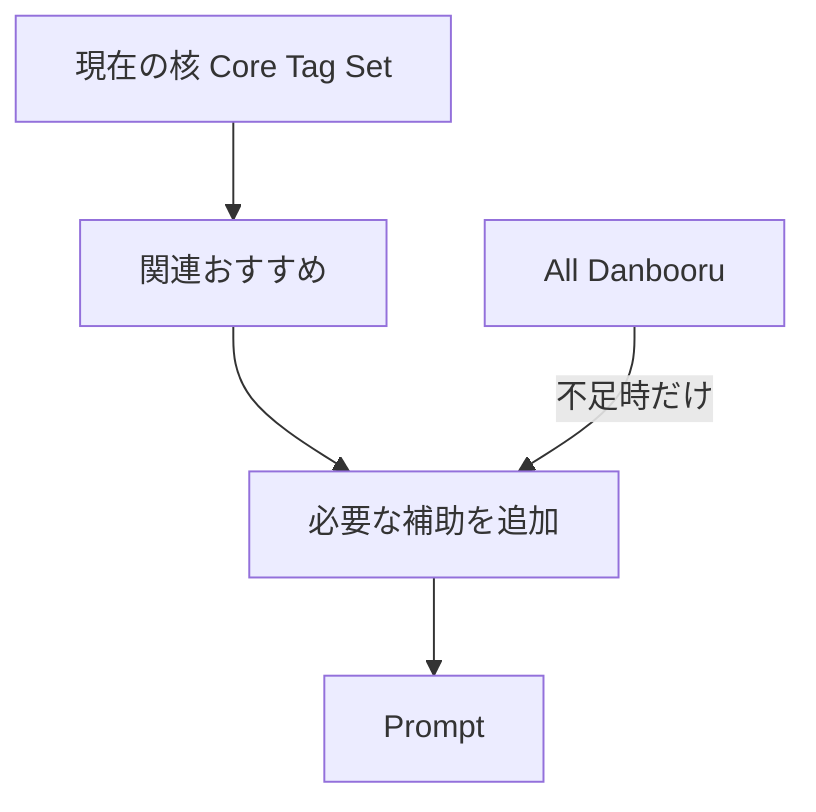

# FLOWCHARTS.md

## 実装Stage

```mermaid
flowchart TD
 A[Stage 0 Source Preservation / Manifest / pytest] --> B[Stage 1 Source Dataset Decision]
 B --> C[Stage 2 AND + Candidate Aggregation Architecture Decision]
 C --> D[Stage 3 Tag Knowledge Core + Static Semantic Bridge]
 D --> E[Stage 4 Unified Japanese / English Search]
 E --> F[Stage 5 Full Index + True AND + Candidate Aggregation]
 F --> G[Stage 6 Statistics / Reliability / Ranking]
 G --> H[Stage 7 Special-first UI]
 H --> I[Stage 8 Semantic UX Refinement]
 I --> J[Stage 9 Prompt Builder / Minimal LoRA]
 J --> K[Stage 10 Final Regression / Benchmark / Packaging]
```

## Stage 1

```mermaid
flowchart TD
 A[Dataset候補] --> B[Gate 1 metadata/schema比較]
 B --> C{最低条件}
 C -- NG --> D[不採用]
 C -- OK --> E[上位1〜2候補]
 E --> F[同一subset Gate 2]
 F --> G{AND用情報が十分か}
 G -- NG --> D
 G -- OK --> H[Approved Source決定]
 H --> I[docs/decisions/DATA_SOURCE_DECISION.md]
```

## Stage 2

```mermaid
flowchart TD
 A[Approved Dataset固定] --> B[同一subset]
 B --> C[Index候補prototype]
 C --> D[AND性能]
 C --> E[Candidate Aggregation性能]
 C --> F[RAM/容量/build]
 D --> G[比較]
 E --> G
 F --> G
 G --> H[docs/architecture/INDEX_ARCHITECTURE_DECISION.md]
```

## 検索

```mermaid
flowchart TD
 A[入力] --> B[comma/newlineで候補単位に分割]
 B --> C[NFKC/lowercase/trim]
 C --> D[Exact canonical]
 D -->|なし| E[Exact alias]
 E -->|なし| F[Japanese exact]
 F -->|なし| G[Semantic exact]
 G -->|なし| H[prefix/partial]
 D -->|hit| I[canonical]
 E -->|unique| I
 F -->|hit| I
 G -->|hit| J[Semantic候補]
 H --> K[Autocomplete候補]
```

## True AND + Candidate Aggregation

```mermaid
flowchart TD
 A[Selected canonical tags] --> B[Tag→Post集合]
 B --> C[AND]
 C --> D[base_posts]
 D --> E[Post→Tag IDsを走査 または候補bitmap方式]
 E --> F[全候補co_count]
 F --> G[Selected/alias/duplicate除外]
 G --> H[statistics]
 H --> I[ranking]
 I --> J[UI]
```

## 最終ユーザーフロー

```mermaid
flowchart TD
 A[特殊辞書から日英で探す] --> B[SpecialをCore Tag Setへ追加]
 B --> C[True AND共起更新]
 C --> D[関連おすすめ]
 D --> E{足りる?}
 E -- Yes --> F[Prompt]
 E -- No --> G[全Danbooruへ広げる]
 G --> B
 F --> H[LoRA]
 H --> I[Copy]
```

## Core Tag Set + Auxiliary

```mermaid
flowchart TD
 A[Special2788] --> B[Core Tag Set]
 B --> C[True multi-tag AND]
 C --> D[Candidate Aggregation]
 D --> E[Auxiliary Candidates]
 E --> F[role別表示: pose/composition/expression/etc]
 F --> G[Auxiliary Tags]
 B --> H[Prompt Builder]
 G --> H
 I[LoRA] --> H
 H --> J[生成Prompt]
```

## 主従を壊さないUI

```mermaid
flowchart TD
 A[現在の核 Core Tag Set] --> B[関連おすすめ]
 B --> C[必要な補助を追加]
 C --> D[Prompt]
 E[All Danbooru] -->|不足時だけ| C
```
