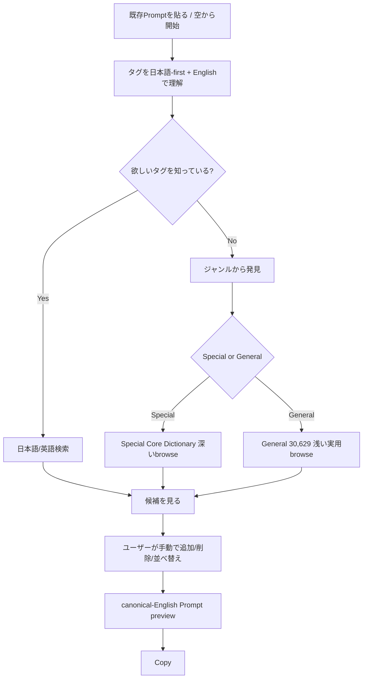
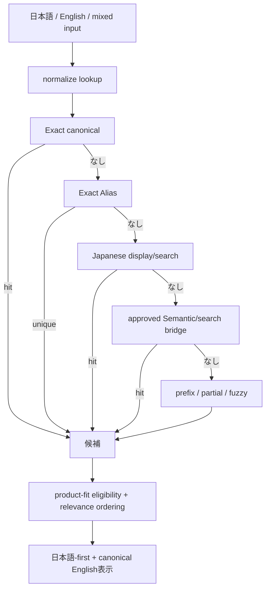
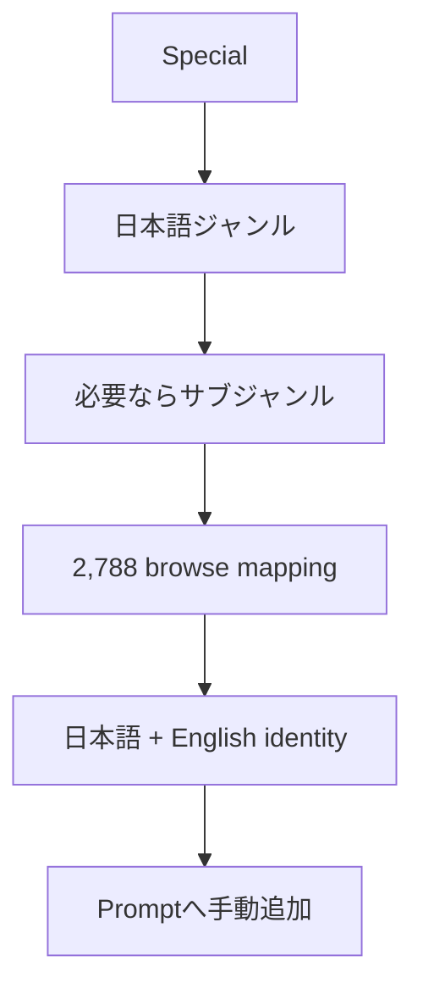
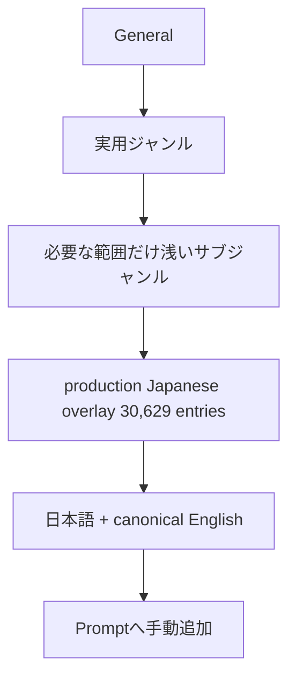
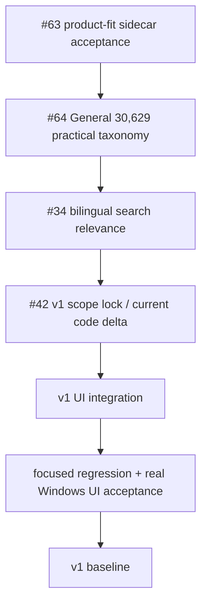
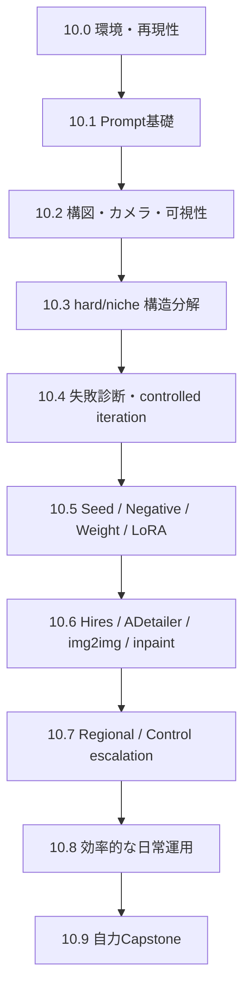
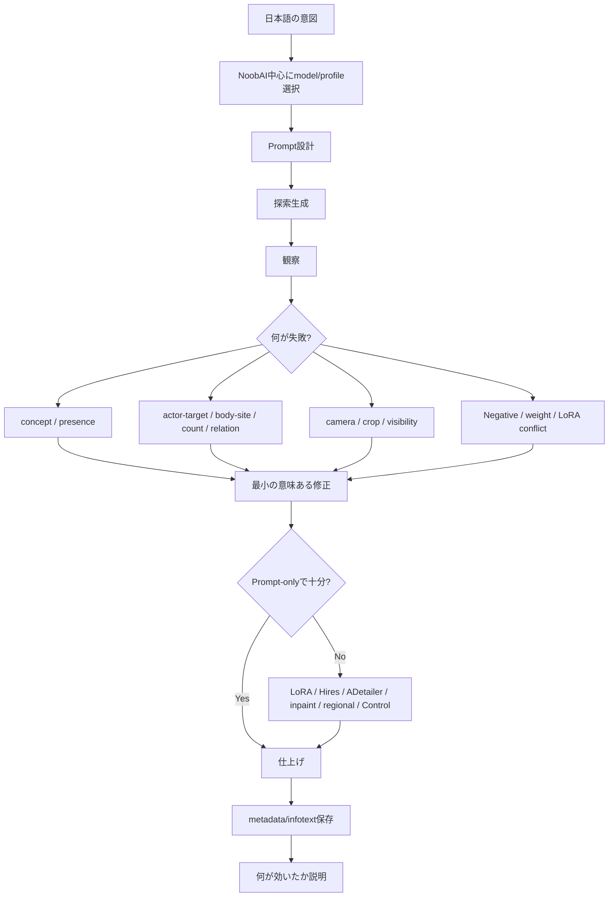
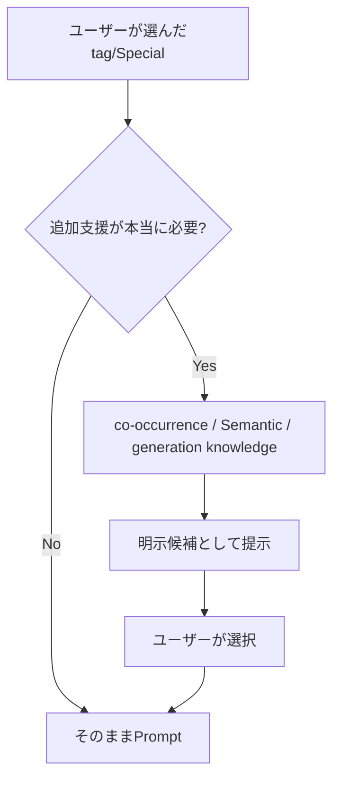
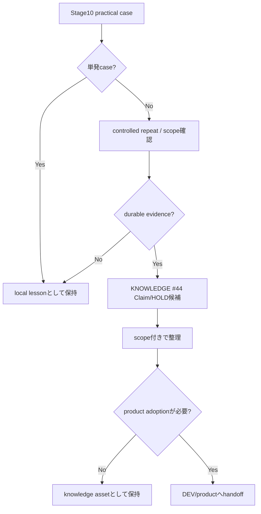

# FLOWCHARTS.md

## Current v1 user flow

## Search flow

Exact/word-boundary intentを incidental substring/fuzzy collision より優先する。
Known defect `anal -> piano / analog...` はIssue #34のscope。

## Special discovery

Special taxonomyは#56で完成済み。
UI browse indexでありcanonical semantic authorityではない。

## General discovery

General taxonomyはIssue #64。
`japanese_overlay.json` へtaxonomyを埋め込まずcanonical-tag keyed sidecarで分離する。
全100k+ Danbooru universeの完全分類はv1 scope外。

## Current development route

Exact execution orderの正本は `docs/project/CURRENT_STATE.md`。この図はその可視化であり、食い違う場合は `CURRENT_STATE.md` を優先する。

Stage10 learning is parallel to this route and is not a v1 Gate.

## Current Stage10 learning flow

Current authority:
- Issue #65
- `docs/stages/STAGE_10_LEARNING.md`

Primary model:
- NoobAI XL 1.1 EPS + Forge Neo

Stage10の実生成ループ:

Hard/nicheの成功判定はpresenceだけでなく、必要に応じてactor / target / ownership / body-site / relation / count / visibility / source-destination / topologyまで見る。

Animaはrelation-heavy / multi-character / tag+natural-languageの比較・fallback lane。
WAI Illustrious v17はhistorical/comparison lane。
NoobAI V-PredはEPSと別profileとして扱う。

## Optional/future product subsystem flow

v1では候補を勝手にPromptへ自動挿入しない。
Stage10で手動学習することと、v1製品へ自動化を追加することは別判断。

## KNOWLEDGE / Stage10 evidence flow

KNOWLEDGEは知識・検証を所有するが、production採用を独断で決めない。

## Historical architecture note

Stage0〜Stage9で作ったfull index、true AND、Candidate Aggregation、recommendation、Generation Profile、Prompt Composer、evaluator infrastructureは削除対象ではない。
旧PROMPT #5のStage10/Prompt handoff資料、旧Stage10 production A/B準備、Issue #30 evaluator/calibrationもhistorical evidence/testing assetsとして保持する。

2026-09-13以降、これらは**新Stage10のcompletion Gateではなく、教材・比較・診断道具**として扱う。

旧 `Special -> true AND -> recommendation -> Prompt -> production A/B Stage10` を現在の必須ユーザーフロー/Stage10定義として扱わない。
