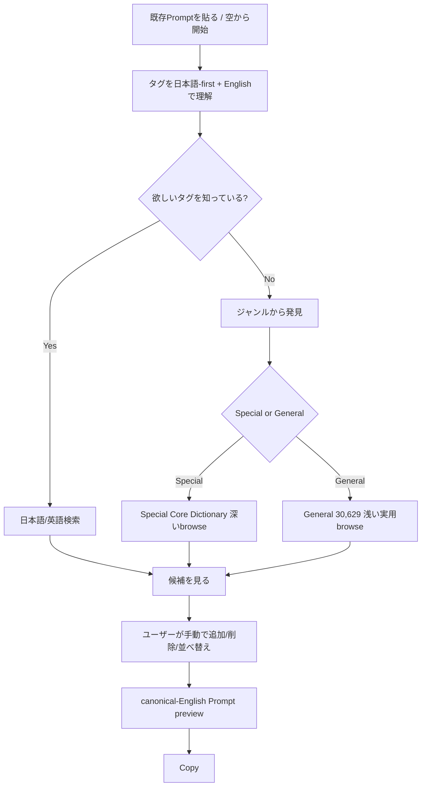
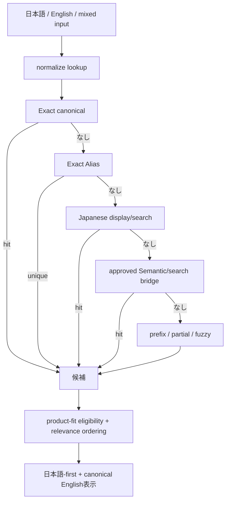
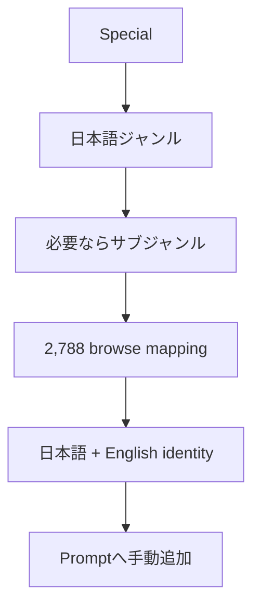
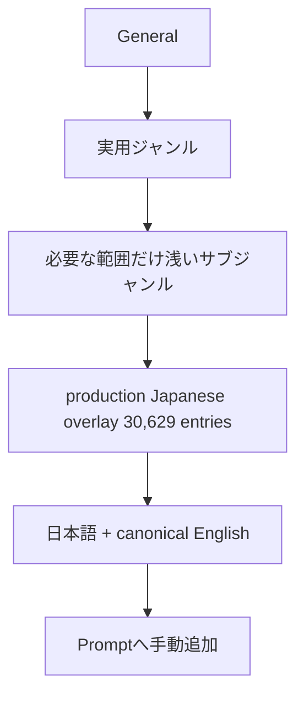
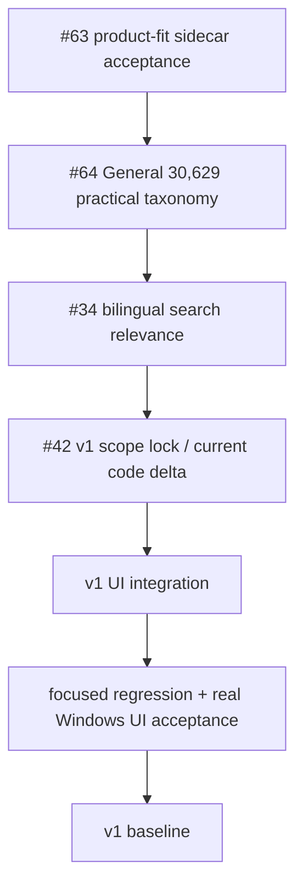
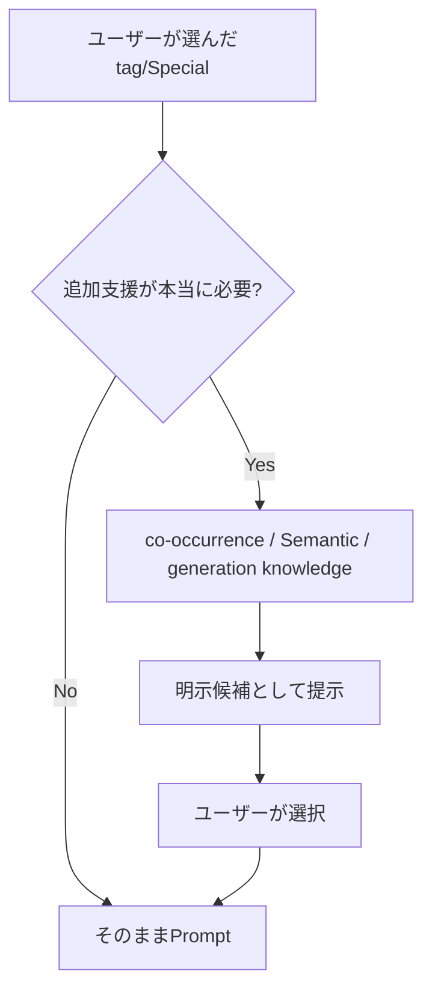

# FLOWCHARTS.md

## Current v1 user flow

## Search flow

Exact/word-boundary intentを incidental substring/fuzzy collision より優先する。
Known defect `anal -> piano / analog...` はIssue #34のscope。

## Special discovery

Special taxonomyは#56で完成済み。
UI browse indexでありcanonical semantic authorityではない。

## General discovery

General taxonomyはIssue #64。
`japanese_overlay.json` へtaxonomyを埋め込まずcanonical-tag keyed sidecarで分離する。
全100k+ Danbooru universeの完全分類はv1 scope外。

## Current development route

Exact execution orderの正本は `docs/project/CURRENT_STATE.md`。この図はその可視化であり、食い違う場合は `CURRENT_STATE.md` を優先する。

Issue #5 / Stage10はこの必須経路の外。
将来、model-specific effectivenessやevidence-backed automatic assistanceを採用した時だけ、必要な狭い実験へ再利用する。

## Optional/future subsystem flow

v1では候補を勝手にPromptへ自動挿入しない。

## Historical architecture note

Stage0〜Stage9で作ったfull index、true AND、Candidate Aggregation、recommendation、Generation Profile、Prompt Composer、evaluator infrastructureは削除対象ではない。
ただし「既に作った」ことはv1 user-facing requirementの根拠にならない。

旧 `Special -> true AND -> recommendation -> Prompt -> Stage10` を現在の必須ユーザーフローとして扱わない。
